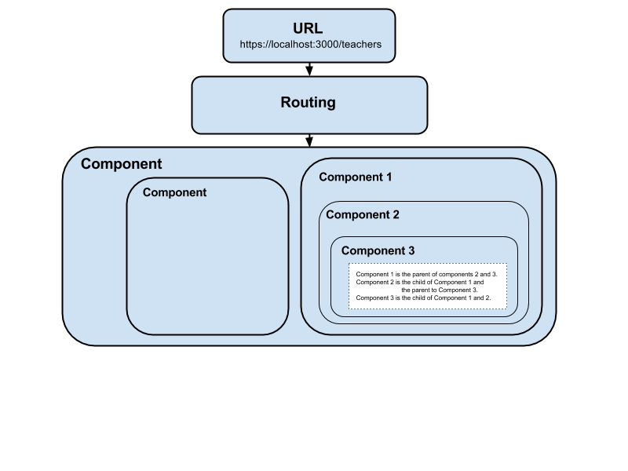

# Creating An Angular 2 Project

What is TypeScript?
> TypeScript starts from the same syntax and semantics that millions of JavaScript developers know today. Use existing JavaScript code, incorporate popular JavaScript libraries, and call TypeScript code from JavaScript. TypeScript compiles to clean, simple JavaScript code which runs on any browser, in Node.js, or in any JavaScript engine that supports ECMAScript 3 (or newer).<sup>2</sup>

>Types enable JavaScript developers to use highly-productive development tools and practices like static checking and code refactoring when developing JavaScript applications. Types are optional, and type inference allows a few type annotations to make a big difference to the static verification of your code. Types let you define interfaces between software components and gain insights into the behavior of existing JavaScript libraries.<sup>2</sup>

Why Angular?
>HTML is great for declaring static documents, but it falters when we try to use it for declaring dynamic views in web-applications. AngularJS lets you extend HTML vocabulary for your application. The resulting environment is extraordinarily expressive, readable, and quick to develop.<sup>1</sup>

Alternatives to Angular
> Other frameworks deal with HTML’s shortcomings by either abstracting away HTML, CSS, and/or JavaScript or by providing an imperative way for manipulating the DOM. Neither of these address the root problem that HTML was not designed for dynamic views.<sup>1</sup>

Angular Extensibility
> AngularJS is a toolset for building the framework most suited to your application development. It is fully extensible and works well with other libraries. Every feature can be modified or replaced to suit your unique development workflow and feature needs.<sup>1</sup>


Angular is a JavaScript framework that uses TypeScript. The design of this project template is taken from the Angular 2 Documentation and there is little need to change the file.  F.  There is an API that allows using standard ECMAScript 5 JavaScript, but it is recommended to use TypeScript.  

## Set up
+ Install node.js and npm.
+ Install TypeScript globally as a regular npm package `npm install typescript -g`.  Check installation by checking TypeScript version `tsc -v`.  
  + If using the text editor Atom, optionaly install `apm install atom-typescript` to use autocomplete and TypeScript specific linting.  Having a TypeScript package installed for your text editor allows the compiler to warn you about errors as you type, without even needing to compile.
+ Run `npm install`, `bower install`, `gulp build`, `gulp serve`.


### Documentation
+ <sup>1</sup>  [Angular 2 Documentation](https://angular.io/docs/ts/latest/quickstart.html)
+ <sup>2 </sup> [TypeScript Documentation](https://www.typescriptlang.org/)
+ <sup>3 </sup> [ECMAScript Wikipedia Page](https://en.wikipedia.org/wiki/ECMAScript)

## Starting Files

###### File Structure
 app  
--  app.component.ts  
--  app.module.ts  
--  main.ts  
 resources   
--  styles  
--  js  
--  images   
 .gitignore  
 gulpfile.js  
 index.html  
 package.json  
 systemjs.config.js  
 tsconfig.json  
 typings.json

Most of the .gitignore files will be created by `gulp build`.
###### .gitignore
```
node_modules/
npm-debug.log
bower_components/
app/*.js
app/*.js.map
.DS_Store
build/
typings/
```
###### gulpfile.js
```js
///////////////////// DEPENDENCIES AND VARIABLES //////////////////////
var gulp = require('gulp');
// used for concatenating/minifying bower files and other js/css
var concat = require('gulp-concat');
var uglify = require('gulp-uglify');
// used for build and clean tasks.
var utilities = require('gulp-util');
var buildProduction = utilities.env.production;
var del = require('del');
// set up server with watchers and run typescript compiler in the shell.
var browserSync = require('browser-sync').create();
var shell = require('gulp-shell');
// sass dependencies.
var sass = require('gulp-sass');
var sourcemaps = require('gulp-sourcemaps');
// used for pulling in bower files.
var lib = require('bower-files')({
  "overrides":{
    "bootstrap" : {
      "main": [
        "less/bootstrap.less",
        "dist/css/bootstrap.css",
        "dist/js/bootstrap.js"
      ]
    }
  }
});

////////////////////// TYPESCRIPT //////////////////////
// clean task
gulp.task('tsClean', function(){
  return del(['app/*.js', 'app/*.js.map']);
});

// clean and then compile once. To be called from server and global build.
gulp.task('ts', ['tsClean'], shell.task([
  'tsc'
]));

////////////////////// BOWER //////////////////////
// when adding a new bower depndency:
// stop the server
// always use the `bower install --save` flag.
// run `gulp bower` to build vendor files
// restart server.

gulp.task('jsBowerClean', function(){
  return del(['./build/js/vendor.min.js']);
});

gulp.task('jsBower', ['jsBowerClean'], function() {
  return gulp.src(lib.ext('js').files)
    .pipe(concat('vendor.min.js'))
    .pipe(uglify())
    .pipe(gulp.dest('./build/js'));
});

gulp.task('cssBowerClean', function(){
  return del(['./build/css/vendor.css']);
});

gulp.task('cssBower', ['cssBowerClean'], function() {
  return gulp.src(lib.ext('css').files)
    .pipe(concat('vendor.css'))
    .pipe(gulp.dest('./build/css'));
});

gulp.task('bower', ['jsBower', 'cssBower']);

////////////////////// SASS //////////////////////

gulp.task('sassBuild', function() {
  return gulp.src(['resources/styles/*'])
    .pipe(sourcemaps.init())
    .pipe(sass())
    .pipe(sourcemaps.write())
    .pipe(gulp.dest('./build/css'));
});

////////////////////// SERVER //////////////////////
gulp.task('serve', ['build'], function() {
  browserSync.init({
    server: {
      baseDir: "./",
      index: "index.html"
    }
  });
  gulp.watch(['resources/js/*.js'], ['jsBuild']); // vanilla js changes, reload.
  gulp.watch(['*.html'], ['htmlBuild']); // html changes, reload.
  gulp.watch(['resources/styles/*.css', 'resources/styles/*.scss'], ['cssBuild']); // css or sass changes, concatenate all css/sass, build, reload.
  gulp.watch(['app/*.ts'], ['tsBuild']); // typescript files change, compile then reload.
});

gulp.task('jsBuild', function(){
  browserSync.reload();
});

gulp.task('htmlBuild', function(){
  browserSync.reload();
});

gulp.task('cssBuild', ['sassBuild'], function(){
  browserSync.reload();
});

gulp.task('tsBuild', ['ts'], function(){
  browserSync.reload();
});

////////////////////// GLOBAL BUILD TASK //////////////////////
// global build task with individual clean tasks as dependencies.
gulp.task('build', ['ts'], function(){
  // we can use the buildProduction environment variable here later.
  gulp.start('bower');
  gulp.start('sassBuild');
});
```

Few changes will ever be made to `index.html` because we are using gulp to set up our assets and `<my-app>` holds all controllers.
###### index.html
```html
<html>
  <head>
    <title>Project Name</title>
    <meta charset="UTF-8">
    <meta name="viewport" content="width=device-width, initial-scale=1">
    <script src="build/js/vendor.min.js"></script>
    <link rel="stylesheet" href="build/css/vendor.css">
    <!-- 1. Load libraries -->
     <!-- Polyfill(s) for older browsers -->
    <script src="node_modules/core-js/client/shim.min.js"></script>
    <script src="node_modules/zone.js/dist/zone.js"></script>
    <script src="node_modules/reflect-metadata/Reflect.js"></script>
    <script src="node_modules/systemjs/dist/system.src.js"></script>
    <!-- 2. Configure SystemJS -->
    <script src="systemjs.config.js"></script>

    <link rel="stylesheet" href="build/css/styles.css">
    <script>
      System.import('app').catch(function(err){ console.error(err); });
    </script>
  </head>
  <!-- 3. Display the application -->
  <body>
    <my-app>Loading...</my-app>
  </body>
</html>
```
The next four files are taken from Angular documentation with a few additions to add other packages (as seen above).
###### systemjs.config.js
```js
/**
 * System configuration for Angular 2 samples
 * Adjust as necessary for your application needs.
 */
(function (global) {
  System.config({
    paths: {
      // paths serve as alias
      'npm:': 'node_modules/'
    },
    // map tells the System loader where to look for things
    map: {
      // our app is within the app folder
      app: 'app',
      // angular bundles
      '@angular/core': 'npm:@angular/core/bundles/core.umd.js',
      '@angular/common': 'npm:@angular/common/bundles/common.umd.js',
      '@angular/compiler': 'npm:@angular/compiler/bundles/compiler.umd.js',
      '@angular/platform-browser': 'npm:@angular/platform-browser/bundles/platform-browser.umd.js',
      '@angular/platform-browser-dynamic': 'npm:@angular/platform-browser-dynamic/bundles/platform-browser-dynamic.umd.js',
      '@angular/http': 'npm:@angular/http/bundles/http.umd.js',
      '@angular/router': 'npm:@angular/router/bundles/router.umd.js',
      '@angular/forms': 'npm:@angular/forms/bundles/forms.umd.js',
      // other libraries
      'rxjs':                       'npm:rxjs',
      'angular2-in-memory-web-api': 'npm:angular2-in-memory-web-api',
    },
    // packages tells the System loader how to load when no filename and/or no extension
    packages: {
      app: {
        main: './main.js',
        defaultExtension: 'js'
      },
      rxjs: {
        defaultExtension: 'js'
      },
      'angular2-in-memory-web-api': {
        main: './index.js',
        defaultExtension: 'js'
      }
    }
  });
})(this);
```

###### package.json
```json
{
  "name": "angular2-skeleton",
  "version": "1.0.0",
  "scripts": {
    "start": "tsc && concurrently \"npm run tsc:w\" \"npm run lite\" ",
    "lite": "lite-server",
    "postinstall": "typings install",
    "tsc": "tsc",
    "tsc:w": "tsc -w",
    "typings": "typings"
  },
  "license": "ISC",
  "dependencies": {
    "@angular/common": "2.0.0-rc.6",
    "@angular/compiler": "2.0.0-rc.6",
    "@angular/compiler-cli": "0.6.0",
    "@angular/core": "2.0.0-rc.6",
    "@angular/forms": "2.0.0-rc.6",
    "@angular/http": "2.0.0-rc.6",
    "@angular/platform-browser": "2.0.0-rc.6",
    "@angular/platform-browser-dynamic": "2.0.0-rc.6",
    "@angular/router": "3.0.0-rc.2",
    "@angular/upgrade": "2.0.0-rc.6",
    "core-js": "^2.4.1",
    "reflect-metadata": "^0.1.3",
    "rxjs": "5.0.0-beta.11",
    "systemjs": "0.19.27",
    "zone.js": "^0.6.17",
    "angular2-in-memory-web-api": "0.0.18",
    "bootstrap": "^3.3.6"
  },
  "devDependencies": {
    "bower-files": "^3.11.3",
    "browser-sync": "^2.11.1",
    "del": "^2.2.0",
    "gulp": "^3.9.1",
    "gulp-concat": "^2.6.0",
    "gulp-sass": "^2.2.0",
    "gulp-shell": "^0.5.2",
    "gulp-sourcemaps": "1.6.0",
    "gulp-uglify": "^1.5.3",
    "gulp-util": "^3.0.7",
    "concurrently": "^2.2.0",
    "lite-server": "^2.2.2",
    "typescript": "^1.8.10",
    "typings":"^1.3.2"
  }
}
```

###### tsconfig.json
```json
{
  "compilerOptions": {
    "target": "es5",
    "module": "commonjs",
    "moduleResolution": "node",
    "sourceMap": true,
    "emitDecoratorMetadata": true,
    "experimentalDecorators": true,
    "removeComments": false,
    "noImplicitAny": false
  }
}
```

###### typings.json
```json
{
  "globalDependencies": {
    "core-js": "registry:dt/core-js#0.0.0+20160725163759",
    "jasmine": "registry:dt/jasmine#2.2.0+20160621224255",
    "node": "registry:dt/node#6.0.0+20160831021119"
  }
}
```


## Angular Files

###### app/app.component.ts
```ts
import { Component } from '@angular/core';

@Component({
  selector: 'my-app',
  template: `
  <h1>My First Angular 2 App</h1>
  `
})

export class AppComponent {

}
```

This file will also be responsible for loading other components and parts of our app, as well as Angular specific dependencies such as the BrowserModule, which is used to let Angular communicate with the browser.
###### app/app.component.ts
```ts
import { NgModule }       from '@angular/core';
import { BrowserModule }  from '@angular/platform-browser';
import { AppComponent }   from './app.component';

@NgModule({
  imports: [BrowserModule],
  declarations: [ AppComponent ],
  bootstrap:    [ AppComponent ]
})

export class AppModule { }
```

###### app/main.ts
```ts
import { platformBrowserDynamic } from '@angular/platform-browser-dynamic';
import { AppModule } from './app.module';

const platform = platformBrowserDynamic();

platform.bootstrapModule(AppModule);
```

## Explanations, Definitions, Terms, Examples

###### Model-View-Controller Pattern
As web applications gain increasingly rich and complex user interfaces, a new breed of tools called "client-side MVCs.  MVC stands for Model-View-Controller and refers to a pattern where data, processing and display duties are divided into models, views and controllers.  Three of the most popular client-side JavaScript MVC tools are Angular, Ember, and React, a model originally pioneered by React.js.

##### Terms
+ **MVC:** Abbreviation for Model-View-Controller that refers to a pattern where data, processing and display duties are divided into models, views and controllers.
+ **Component:** In MVC frameworks, a container for a section of a website's functionality including both the user interface and the logic to connect it with the models.
+ **Routing:** In MVC frameworks, the mapping of a URL to a component.
+ **Model:** In the MVC context, the data that is provided to a component.

### TypeScript
Angular-based apps can be written in JavaScript and another programming language called Dart.  TypeScript provides tools to build code more robustly: TypeScript lets you define types for your data.  
All properties and methods are public by default. This means they can be accessed from anywhere.
##### Terms
+ **Optional typing:** A feature of TypeScript that allows the developer to declare the data type of a variable.
+ **Loosely typed:** A description for a language that does not require the developer to define the data type of a variable (e.g. JavaScript).
+ **Type annotations:** Definitions for variables that initialize them with a type instead of allowing a type to be inferred.
+ **Class declaration:** Think of a class as a blueprint for an object, which itself is the most basic and most customizable building block of JavaScript. Classes allow us to declare methods - actions that every instance of that class will be able to take.
+ **Inheritance:** The act of a class inheriting from another (base) class. When a class inherits another class, it gains access to all its public properties and methods.  
  + **Child class:** The class inheriting another (base) class.
  + **Super:** A keyword used to refer to the parent class from within the child class.The **super** keyword is required when creating a constructor in a child class. It calls the parent's constructor.
  + Declaring a child class syntax: ``class child extends parent {}``.
+ **Interface:** A group of methods and properties multiple different classes may inherit.
  ###### example
  ```ts
  interface Noisy {
    sound: string;
  }

  class Elephant implements Noisy {
    constructor(public sound: string){}
    angryNoise(){
      console.log("rumble");
    }
  }
  ```
  + **Implement:** The act of assigning an interface to a class or property.
  + **Child interface:** An interface that extends another interface.
  + **Inheritance:** Gaining properties or methods from another component. For instance, classes may inherit other classes in order to access their methods and properties. Interfaces may also inherit from other interfaces, to access their methods and properties.

### Angular
**Components:** are the basic building blocks of an Angular 2 app.  _Components_ are represented by a custom HTML element, like `<user-profile>.` Data is passed in using attributes, like `<user-profile name="Diane" job="Teacher">`.  When the value of an attribute changes, the component automatically updates the user interface!  Components are isolated--they can't directly change other components--but instead, components may emit actions that are received by parent component. The parent may then take an action of its own, which may be passed into its child components.  This is referred to as _"data down, actions up"_   A _component_ has a selector property.

**Selectors** interact with DOM elements, the _component's selector is the DOM element the component is attached to_ (generally a new HTML tag). A selector is a native AngularJS directive that transform a simple `<select>` box into a full html select with typeahead.  A _component_ also must include a template. A **template** is made up of the HTML that we want to display inside of our _selector_.  A _component_ has two halves: An annotation and a class definition.  We have one component called the **root component** that is responsible for loading its child components.  The @Component() defining our annotation is called a **decorator**. _Decorator_  are a design pattern that is used to separate modification or decoration of a class without modifying the original source code. In Angular, decorators are functions that allow a service, directive or filter to be modified prior to its usage.

##### Terms
+ **Modules:** Modular "containers" of code assigned to specific names (or "namespaces"). They can be exported, then called upon for use in other code.  Modules allow splitting up programs into multiple files, while wrapping our declarations in particular namespaces.
+ **Export:** A keyword that may be added to any declarations you may want to access in other files.
+ **Entry point:** The file that will launch first when an app is first booted up.

## Short Term Code Snippets
Complile TypeScript: ``$ tsc app/hello.ts``

##### How to write a class  
```ts
class Name {
  //Listing variables
  variableName : type;

  //A constructor acting a setter
  constructor ( anotherVariablename:type ) {
    this.variableName = anotherVariablename;
  }

  //Writing methods - here is a random method.
  method() {
    console.log(variableName);
  }
}
```
You can shorten the class declaration by adding the word public to our constructor parameter list.

##### for of
```ts
for(var thing of things) {
  console.log(thing);
};
```
use `in` instead of `of` to put the index number of each element into the array instead of the element.

###### Addin a component
```ts

@Component({
  selector: 'my-app',
  template: `
  <h1>My First Angular 2 App</h1>
  `
})

export class AppComponent {
}
```
